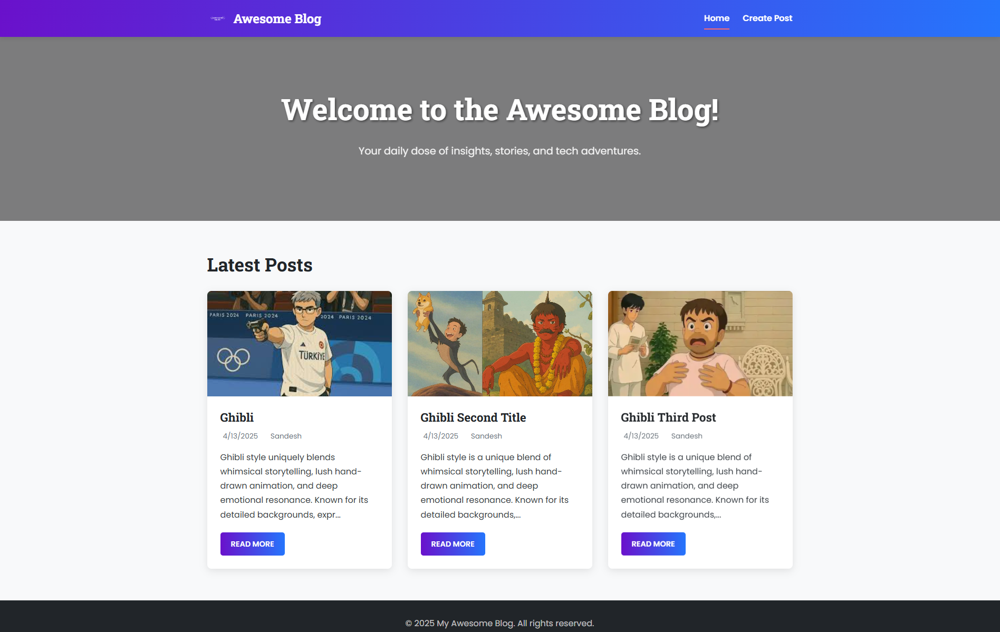
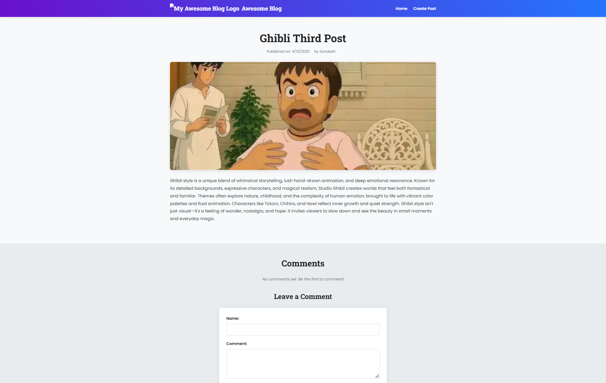
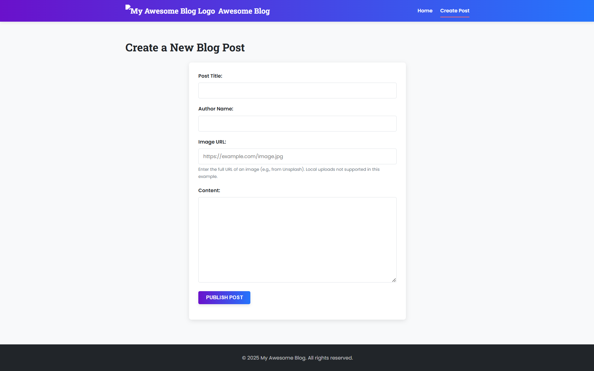

# Awesome Frontend Blog Website

A dynamic and visually appealing blog website built entirely with front-end technologies (HTML, CSS, JavaScript). It allows users to view posts, read individual articles, leave comments, and even create new posts, with all data persisted using the browser's Local Storage.

This project serves as a practical example of building a functional web application without a backend, focusing on DOM manipulation, event handling, responsive design, and client-side data storage.

## ✨ Features

- **View Posts:** Browse a list of blog posts on the homepage, displayed in attractive cards.
- **Read Full Articles:** Click on a post to view its full content on a dedicated page.
- **Create Posts:** A dedicated page with a form to add new blog posts (title, author, content, optional image URL).
- **Commenting System:** Leave comments (name and message) on individual blog posts.
- **Responsive Design:** Adapts smoothly to various screen sizes (desktops, tablets, mobile phones) using CSS media queries.
- **Client-Side Storage:** Uses **Local Storage** to save newly created posts and comments, making them persistent within the user's browser session.
- **Modern UI:** Clean layout with CSS variables, gradients, hover effects, and readable typography.
- **Mobile Navigation:** Includes a functional hamburger menu for smaller screens.

## 📸 Screenshots

Here's a glimpse of the Awesome Frontend Blog:

**Homepage:**


**Single Post Page:**


**Create Post Page:**


**Mobile Responsive View:**


## 🛠️ Technologies Used

- **HTML5:** Semantic structure for content.
- **CSS3:**
  - Styling and visual presentation.
  - **Flexbox & Grid:** For layout structuring.
  - **CSS Variables:** For maintainable theming (colors, fonts).
  - **Media Queries:** For responsive design across devices.
  - **Transitions & Basic Animations:** For subtle UI effects.
- **JavaScript (ES6+):**
  - **DOM Manipulation:** Dynamically creating and updating page content (posts, comments).
  - **Event Handling:** Managing user interactions (form submissions, clicks).
  - **Local Storage API:** Persisting posts and comments on the client-side.
  - **Client-Side Routing Simulation:** Using URL parameters (`?id=...`) to display specific posts.

## 📁 Project Structure

blog-website/
│
├── index.html # Main homepage displaying post list
├── create-post.html # Page for creating new posts
├── post.html # Template for individual blog posts
│
├── assets/
│ ├── images/ # Blog post images (post1.jpg, etc.)
│ ├── favicon.ico # Site favicon
│ └── logo.png # Site logo
│
├── css/
│ ├── styles.css # Core styles (layout, components, variables, etc.)
│ └── responsive.css # Media queries for responsiveness
│
├── js/
│ ├── script.js # General UI interactions (menu), utility functions
│ ├── posts.js # Logic for loading, displaying, creating posts & Local Storage
│ └── comments.js # Logic for loading, displaying, adding comments & Local Storage
│
└── data/
└── posts.js # Initial seed data for blog posts (used if Local Storage is empty)

## 🚀 Getting Started

To run this project locally:

1.  **Clone the repository:**
    ```bash
    git clone https://github.com/Sandesh-projects/blog-website
    ```
2.  **Navigate to the project directory:**
    ```bash
    cd blog-website
    ```
3.  **Prepare Assets:**
    - Place your `logo.png` and `favicon.ico` inside the `assets/` folder.
4.  **Open in Browser:**
    - Simply open the `index.html` file directly in your web browser (e.g., Chrome, Firefox, Edge). No web server or build step is required for this basic version.

## 💾 Data Storage Note

This project uses the browser's **Local Storage** to save new posts and comments.

**Important:**

- Data is stored _only_ in the user's current browser.
- Clearing browser data (cache, site data, cookies) **will erase** all created posts and comments.
- Data is not shared between different browsers, devices, or users.

## 🌱 Potential Future Enhancements

- Implement a search bar to filter posts by title or content.
- Add categories or tags for organizing posts.
- Integrate a rich text editor (like TinyMCE or Quill.js) for post creation.
- Add pagination for long lists of posts or comments.
- Implement basic form validation feedback beyond alerts.
- Refactor JavaScript into modules for better organization.
- Replace Local Storage with a backend database (e.g., Firebase, Node.js + MongoDB/PostgreSQL) for persistent, shared data and user accounts.

---
